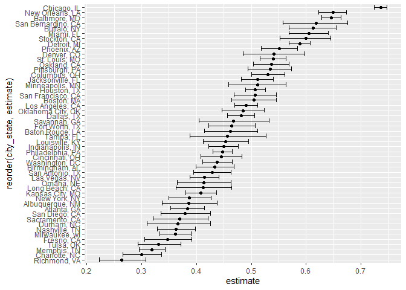
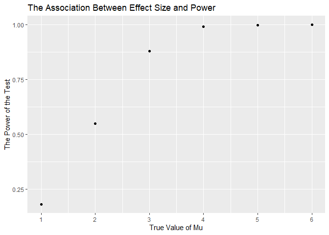
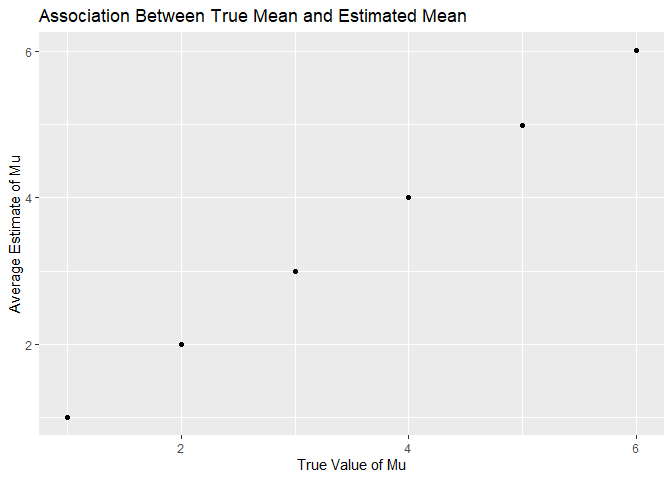

p8105_hw5_hw2850
================
Haoyang Wang
2022-11-06

``` r
library(tidyverse)
```

    ## ── Attaching packages ─────────────────────────────────────── tidyverse 1.3.2 ──
    ## ✔ ggplot2 3.3.6      ✔ purrr   0.3.4 
    ## ✔ tibble  3.1.8      ✔ dplyr   1.0.10
    ## ✔ tidyr   1.2.0      ✔ stringr 1.4.1 
    ## ✔ readr   2.1.2      ✔ forcats 0.5.2 
    ## ── Conflicts ────────────────────────────────────────── tidyverse_conflicts() ──
    ## ✖ dplyr::filter() masks stats::filter()
    ## ✖ dplyr::lag()    masks stats::lag()

``` r
library(rvest)
```

    ## 
    ## Attaching package: 'rvest'
    ## 
    ## The following object is masked from 'package:readr':
    ## 
    ##     guess_encoding

\#Problem 2

``` r
homicide_raw = read_csv("data/homicide-data.csv") %>% 
  janitor::clean_names()
```

    ## Rows: 52179 Columns: 12
    ## ── Column specification ────────────────────────────────────────────────────────
    ## Delimiter: ","
    ## chr (9): uid, victim_last, victim_first, victim_race, victim_age, victim_sex...
    ## dbl (3): reported_date, lat, lon
    ## 
    ## ℹ Use `spec()` to retrieve the full column specification for this data.
    ## ℹ Specify the column types or set `show_col_types = FALSE` to quiet this message.

The raw data contains the homicides victims’ information including the
reported date, victims’ names, victims’ age, victims’ race, victims’
sex, the cities and the states that homicides occurred, the precise
location of homicides (latitude, longitude), and the disposition/result
of homicides.

``` r
homicide_city_state = read_csv("data/homicide-data.csv") %>% 
  janitor::clean_names() %>% 
  mutate(.data = ., city_state = str_c(city, ", " ,state)) %>% 
  select(-city, -state) %>% 
  mutate(
    disposition = if_else(disposition %in% c("Closed without arrest", "Open/No arrest"), "unsolved_homicides", "homicides") 
  )
```

    ## Rows: 52179 Columns: 12
    ## ── Column specification ────────────────────────────────────────────────────────
    ## Delimiter: ","
    ## chr (9): uid, victim_last, victim_first, victim_race, victim_age, victim_sex...
    ## dbl (3): reported_date, lat, lon
    ## 
    ## ℹ Use `spec()` to retrieve the full column specification for this data.
    ## ℹ Specify the column types or set `show_col_types = FALSE` to quiet this message.

Combine variables “cities” and “states” into one variable “city_state”.
Group “Closed without arrest” and “Open/No arrest” into category
“unsolved homicides”. Group “Closed by arrest” into category
“homicides”.

``` r
homicide_by_cities = homicide_city_state %>% 
  group_by(city_state, disposition) %>% 
  summarize(n_obs = n()) #group by city_state and disposition and count the number
```

    ## `summarise()` has grouped output by 'city_state'. You can override using the
    ## `.groups` argument.

Summarize within cities to obtain the total number of homicides and the
number of unsolved homicides.

``` r
homicide_pivot = pivot_wider(
  homicide_by_cities,
  names_from = "disposition",
  values_from = "n_obs") #pivot data wider
```

Pivot_wider the homicide_by_cities dataset.

``` r
homicide_pivot = 
  mutate(homicide_pivot,
  total = homicides + unsolved_homicides) #get a total homicides column by adding homicides and unsolved homicides

homicide_pivot = homicide_pivot %>% 
  filter(!city_state == "Tulsa, AL") #Remove Tulsa, AL which seems wrong
```

Add a total column for the total number of homicides.

``` r
Baltimore = homicide_pivot %>% 
  filter(city_state == "Baltimore, MD") #get a Baltimore dataset
```

Filter dataset with only city Baltimore, MD.

``` r
Baltimore_proptest = prop.test(
  x = pull(Baltimore, unsolved_homicides),
  n = pull(Baltimore, total)) %>% 
  broom::tidy() %>% 
  select(estimate, conf.low, conf.high)
```

Do prop.test with city Baltimore data. The estimate proportion of
unsolved homicides is 0.6455607. The confidence interval is between
0.6275625 and 0.6631599.

``` r
prop_test = function(homicide_pivot){
  
  proptest = prop.test(
    x = pull(homicide_pivot, unsolved_homicides),
    n = pull(homicide_pivot, total)) %>% 
    broom::tidy() %>% 
    select(estimate, conf.low, conf.high)
  
  proptest #output
}
```

Write a function about prop.test.

``` r
city_homicides = homicide_pivot %>% 
  nest(data = unsolved_homicides:total) %>% #nest variables unsolved_homicides and total within tidied homicide_pivot dataset 
  mutate(results = map(data, prop_test)) %>% 
  select(city_state, results) %>% 
  unnest(cols = results) #unnest the results
```

Create a dataframe with estimated proportions and CIs for each city by
applying function.

``` r
city_plot = city_homicides %>%  
  ggplot(aes(x = estimate, y = reorder(city_state, estimate)))+ #order the cities by their estimate proportion
  geom_point()+
  geom_errorbar(aes(xmin = conf.low, xmax = conf.high)) #add confidence interval

city_plot
```

<!-- -->

``` r
ggsave("50 Large U.S. Cities Unsolved Homicides Proportion Estimate.pdf", plot = last_plot())
```

    ## Saving 7 x 5 in image

Create a plot showing the estimates and confidence intervals for each
city. From the plot we can see that Chicago, IL has the highest unsolved
homicides proportion estimate. Richmond, VA has the lowest unsolved
homicides proportion estimate.

\#Problem 3

``` r
t_test = function(n = 30, mu, sigma = 5) {
  
  sim_data = tibble(
    x = rnorm(n, mean = mu, sd = sigma),
  )
  
  t_test = t.test(sim_data, conf.level = 0.95) %>% 
    broom::tidy()

}
```

Write a function of a normal distribution with n = 30, sigma = 5.

``` r
sim_results_df =
  expand.grid(
    sample_size = 30,
    mu = c(1, 2, 3, 4, 5, 6),
    iter = 1:5000
  ) %>% 
  mutate(
    estimate_df = map2(.x = sample_size, .y = mu, ~t_test(n = .x, mu = .y))
  ) %>% 
  unnest(estimate_df)
```

Run the simulation for mu = 1:6 for 5000 times.

``` r
#Plot proportion of times the null was rejected and the true value of mu
prop_null_rej = sim_results_df %>% 
  group_by(mu) %>% 
  filter(p.value < 0.05) %>% #Null rejected
  summarize(proportion = n()) %>% 
  ggplot(aes(x = mu, y = proportion/5000))+
  geom_point()+
  scale_x_continuous(breaks = 0:6)+
  labs(x = "True Value of Mu",
       y = "The Power of the Test",
       title = "The Association Between Effect Size and Power")

prop_null_rej
```

<!-- -->
Plot the relationship between the power of the test and true mu. From
the graph, we can see that as the true value of mu increases, the power
of the test increases. When the true value of mu increased to an extent,
the power of the test reached to 1 which means the difference is large
enough that the probability of the test correctly rejects the null
hypothesis reached to 100 percent.

``` r
#plot average estimate mu and true mu
avg_est = sim_results_df %>% 
  group_by(mu) %>% 
  summarize(mean_est = mean(estimate))

avg_est_plot = ggplot(avg_est, aes(x = mu, y = mean_est))+
  geom_point()+
  labs(
    title = "Association Between True Mean and Estimated Mean",
    x = "True Value of Mu",
    y = "Average Estimate of Mu"
  )

avg_est_plot
```

<!-- -->

``` r
#plot average estimate of mu only in null was rejected
avg_est_rej = sim_results_df %>%
  filter(p.value < 0.05) %>% 
  group_by(mu) %>% 
  summarize(mean_est = mean(estimate))

avg_est_rej_plot = ggplot(avg_est, aes(x = mu, y = mean_est))+
  geom_point()+
  labs(
    title = "Association Between True Mean and Estimated Mean When Null Rejected",
    x = "True Value of Mu",
    y = "Average Estimate of Mu"
  )

avg_est_plot
```

<!-- -->
The sample average of mu across tests for which the null is rejected
approximately equal to the true value of mu because as the true value of
mu increases, the power of the test increases, the probability of
successfully rejecting the null increases.
